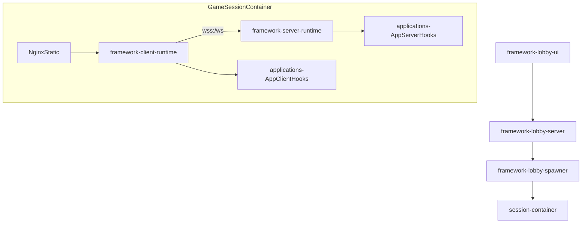

# Framework-first refactor plan

## Target end state

- **Two top-level namespaces**:
- **`framework/`**: reusable primitives for building 2-participant, browser-based, WebSocket-networked, hand-gesture-steered apps.
- **`applications/`**: concrete apps that *call into the framework* to define protocol, state machine, UI, and gameplay/behavior.
- **Three sub-frameworks** (as you suggested):
- **Lobby framework**: session creation, session URL generation, session lifecycle, container/runtime spawning.
- **Server framework**: 2-participant room/session manager, lifecycle (`waiting` → `playing` → `finished` → `reset`), message validation, ticking, broadcast utilities.
- **Client framework**: hand tracking + gesture abstraction, WebSocket client plumbing, lifecycle UX scaffolding (raise-hand gating, play-again flow), rendering loop integration.
- **The existing game becomes**: `applications/blocks-cannons` (name flexible) implemented via a manifest/hooks API.

## Architectural shape (what stays “framework”)

### Lifecycle contract (core invariant)

- A session always has:
- **2 participants max**
- **ready gate**: session starts only once both have raised hands (`player_ready` equivalent)
- **shared world** updates via WebSocket messages
- **end state** with optional **play-again** (same session) or **end session** (lobby cleanup)

### App integration style (your selection)

Apps provide a **manifest + hooks**, roughly:

- **Protocol hooks**: declare client→server and server→client message schemas (Zod), plus serializers.
- **Server hooks**: initialize session state, handle messages, tick/update, compute end conditions, reset.
- **Client hooks**: input mapping (hand gestures → app intents), rendering + UI, respond to server events.
- **Lobby hooks**: session metadata, routing to the right app, spawn config.

## Proposed repo/package restructuring (incremental, low-risk)

Keep npm workspaces, but split framework vs apps into packages:

- `packages/framework-protocol/` (or fold into `framework-core` if you prefer)
- `packages/framework-server/`
- `packages/framework-client/`
- `packages/framework-lobby/`
- `packages/applications/blocks-cannons/` (ported from current implementation)

We’ll preserve a working build at each phase by **dual-running** old entrypoints until the app is fully ported.

## High-level data flow (post-refactor)

## Work breakdown into doable portions

### Portion 0 — Lock the public “contract” and naming (small but crucial)

- Define the framework’s canonical **session lifecycle** and minimum message set:
- `welcome`, `opponent_joined/left`, `player_ready`, `session_started`, `session_finished`, `session_reset`, `error`.
- Decide where **hand readiness** lives: framework-level (recommended) vs app-level.
- Define the framework’s concept of **AppId** and session URL scheme:
- e.g. `/{appId}/...` for lobby UI, and `https://{sessionId}-{appId}.domain` or `https://{sessionId}.domain/{appId}`.

Deliverable: a short doc + TypeScript types in the new framework packages.

### Portion 1 — Extract protocol plumbing into `framework-protocol`

Current code to leverage:

- Shared Zod protocol union in `packages/shared/src/protocol/index.ts`

Steps:

- Create a generic message envelope + helpers (parse/serialize/type-guards).
- Move “generic session lifecycle” messages to framework.
- Keep **app-specific** messages in the application package.

Deliverable: framework-level protocol module + example app protocol still working.

### Portion 2 — Build `framework-server` runtime and adapt existing server to it

Current code to leverage:

- `packages/server/src/server.ts` (`BlockGameServer`)
- `packages/server/src/game/GameManager.ts` (connection + lifecycle + tick)
- `packages/server/src/protocol/handlers.ts`
- `packages/server/src/game/GameState.ts`

Steps:

- Introduce a `FrameworkServer` that owns:
- WebSocket accept, connection registry, 2-player admission, inactivity handling
- framework lifecycle gating (waiting/playing/finished)
- message decode/validate dispatch
- broadcast routing (`sender`/`opponent`/`all`)
- Define `ServerAppHooks` for:
- `createInitialState()`
- `onClientMessage(state, msg, ctx)` → `{state, responses}`
- `tick(state, dt)` → `{state, responses}`
- `isFinished(state)` and `reset(state)`
- Port the existing game’s server logic into `applications/blocks-cannons/server` implementing those hooks.

Deliverable: server framework runs an app via hooks; game still playable.

### Portion 3 — Build `framework-client` runtime and adapt existing client to it

Current code to leverage:

- `packages/client/src/main.ts` (orchestrator)
- `packages/client/src/input/*` (`HandTracker`, `GestureDetector`)
- `packages/client/src/network/GameClient.ts`
- `packages/client/src/game/InteractionManager.ts`
- `packages/client/src/ui/StatusDisplay.ts`

Steps:

- Create `FrameworkClientRuntime` that owns:
- connection lifecycle, reconnection policy, parsing server messages
- the **raise-hand gating** and standard overlays (ready, waiting, finished, play-again)
- hand tracking lifecycle (start/stop) with a stable API: `HandInputFrame`
- Define `ClientAppHooks` for:
- `configureFromWelcome(welcome)`
- `renderFrame(ctx)`
- `onServerEvent(msg)`
- `mapHandInputToIntents(handFrame)`
- optional UI panel contributions
- Move MediaPipe specifics behind a framework abstraction (keep current implementation, but hide it).
- Port blocks-cannons client to implement hooks.

Deliverable: a generic client runtime that can host multiple apps; current game works as an app.

### Portion 4 — Build `framework-lobby` and make lobby multi-app aware

Current code to leverage:

- `packages/lobby/src/server.ts`, `packages/lobby/src/index.ts`
- `packages/lobby/src/routes/sessions.ts`
- `packages/lobby/src/services/DockerSpawner.ts`
- `packages/lobby/src/services/SessionStore.ts`

Steps:

- Define a `LobbyAppRegistry` with per-app metadata:
- appId, display name, spawn requirements, optional bot support
- Update session API to include appId:
- `POST /api/sessions { appId, opponentType, ... }`
- Update spawning to pass `APP_ID` (and optionally app config) into the session container.
- Keep the wrapper script restrictions, but allow routing to the right app inside the container.

Deliverable: lobby can create sessions for arbitrary registered apps.

### Portion 5 — Container/runtime wiring for multi-app sessions

Current code to leverage:

- `docker/game-session/Dockerfile`, `docker/game-session/entrypoint.sh`, `docker/game-session/nginx.conf`

Steps:

- Decide whether a session container hosts:
- **Option A (recommended now)**: one selected app per container (set by `APP_ID`)
- Option B: many apps in one image with runtime selection
- Update nginx/client to serve the correct app bundle (or a framework shell that loads app assets).
- Ensure `/ws` still routes to the correct server instance.

Deliverable: game-session containers can run the selected app.

### Portion 6 — Port the existing game as `applications/blocks-cannons`

Steps:

- Move current gameplay modules into the application package:
- server gameplay state (`GameState`, subsystems)
- client rendering (`scene/*`), interaction mapping (`InteractionManager`), effects
- app-specific protocol messages
- Replace direct wiring in `client/src/main.ts` and `server/src/index.ts` with framework bootstraps.

Deliverable: the game exists purely as an app; framework is app-agnostic.

### Portion 7 — Developer experience & guardrails

- Add templates/examples:
- “hello-two-hands” sample app
- “minimal-canvas” sample app
- Add docs:
- how to create a new app
- lifecycle and message contract
- Add conformance tests:
- framework-server: 2-player admission, ready gate, disconnect behavior
- framework-client: ready gate + play-again flow

Deliverable: creating a second app is straightforward and doesn’t require copying game code.

## Migration strategy (to keep things shippable)

- Maintain existing packages during early portions.
- Introduce framework packages, then port server first (lowest UI churn), then client, then lobby.
- Keep existing Docker deployment working by supporting `blocks-cannons` as default `APP_ID` until multi-app is proven.

## Key files most likely to change (by phase)

- Protocol extraction: `[...]/packages/shared/src/protocol/index.ts`
- Server refactor: `[...]/packages/server/src/server.ts`, `[...]/packages/server/src/game/GameManager.ts`, `[...]/packages/server/src/protocol/handlers.ts`
- Client refactor: `[...]/packages/client/src/main.ts`, `[...]/packages/client/src/network/GameClient.ts`, `[...]/packages/client/src/input/*`, `[...]/packages/client/src/game/InteractionManager.ts`
- Lobby refactor: `[...]/packages/lobby/src/routes/sessions.ts`, `[...]/packages/lobby/src/services/DockerSpawner.ts`, `[...]/packages/lobby/src/services/SessionStore.ts`
- Container wiring: `[...]/docker/game-session/*`

## Acceptance criteria (what “done” means)

- You can add `packages/applications/new-app/` without editing framework internals (beyond registering it in the lobby registry).
- A session can be created for any app; join URL works; game starts only when both raise hands.