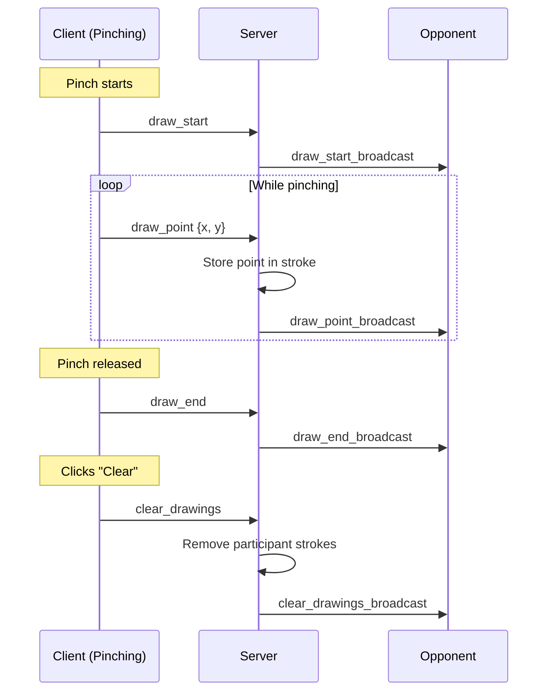

# Hello Hands Drawing Feature

## Architecture Overview




## Implementation

### 1. Extend Protocol ([`src/shared/protocol.ts`](packages/applications/hello-hands/src/shared/protocol.ts))

Add new message types:**Client -> Server:**

- `draw_start` - Begin a new stroke
- `draw_point` - Add point to current stroke `{x: number, y: number}`
- `draw_end` - End current stroke
- `clear_drawings` - Clear all own drawings

**Server -> Client:**

- `draw_start_broadcast` - Opponent started drawing
- `draw_point_broadcast` - Opponent drew a point `{participantId, x, y}`
- `draw_end_broadcast` - Opponent ended stroke
- `clear_drawings_broadcast` - Opponent cleared their drawings

### 2. Add Stroke Types ([`src/shared/types.ts`](packages/applications/hello-hands/src/shared/types.ts))

```typescript
interface Point2D { x: number; y: number }
interface Stroke {
  participantId: ParticipantId;
  points: Point2D[];
}
```


### 3. Update Server Session ([`src/server/HelloHandsSession.ts`](packages/applications/hello-hands/src/server/HelloHandsSession.ts))

- Add `strokes: Stroke[]` and `activeStrokes: Map<ParticipantId, Stroke>` to state
- Handle `draw_start`: Create new stroke in `activeStrokes`
- Handle `draw_point`: Add point to active stroke, broadcast
- Handle `draw_end`: Move stroke from `activeStrokes` to `strokes`, broadcast
- Handle `clear_drawings`: Remove strokes for sender, broadcast
- Include existing strokes in `HelloHandsWelcomeData` for late joiners

### 4. Update Client ([`client/main.ts`](packages/applications/hello-hands/client/main.ts))

- Track local strokes array for rendering
- Track `isCurrentlyDrawing` state
- On pinch start: send `draw_start`, begin local stroke
- While pinching: send `draw_point` (throttled), add to local stroke
- On pinch end: send `draw_end`
- Handle incoming draw broadcasts: add to strokes array
- Render all strokes in the render loop using participant colors

### 5. Add UI ([`client/index.html`](packages/applications/hello-hands/client/index.html), [`client/styles.css`](packages/applications/hello-hands/client/styles.css))

- Add "Clear My Drawings" button next to existing "Wave" button
- Style to match existing control bar aesthetic

## Testing

### 6. Protocol Tests ([`tests/shared.test.ts`](packages/applications/hello-hands/tests/shared.test.ts))

Extend existing tests with:

- Parse/validate `draw_start`, `draw_point`, `draw_end`, `clear_drawings` messages
- Serialize `draw_point_broadcast`, `draw_start_broadcast`, `draw_end_broadcast`, `clear_drawings_broadcast`
- Reject malformed draw messages (missing coordinates, invalid types)

### 7. Server Session Tests (new file `tests/server/HelloHandsSession.test.ts`)

Create unit tests for `HelloHandsHooks`:

- `onMessage('draw_start')` creates active stroke, broadcasts to opponent
- `onMessage('draw_point')` adds point to active stroke, broadcasts
- `onMessage('draw_end')` finalizes stroke, broadcasts
- `onMessage('clear_drawings')` removes sender's strokes, broadcasts
- `onParticipantJoin` returns existing strokes in welcome data
- `onParticipantLeave` cleans up participant's strokes
- `onReset` clears all strokes

## Key Design Decisions

- **Stroke-based model**: Drawing is organized into strokes (start/end) rather than individual points, enabling efficient clear operations and potential undo
- **Throttled point transmission**: Reuse existing 50ms throttle interval for draw points to avoid flooding