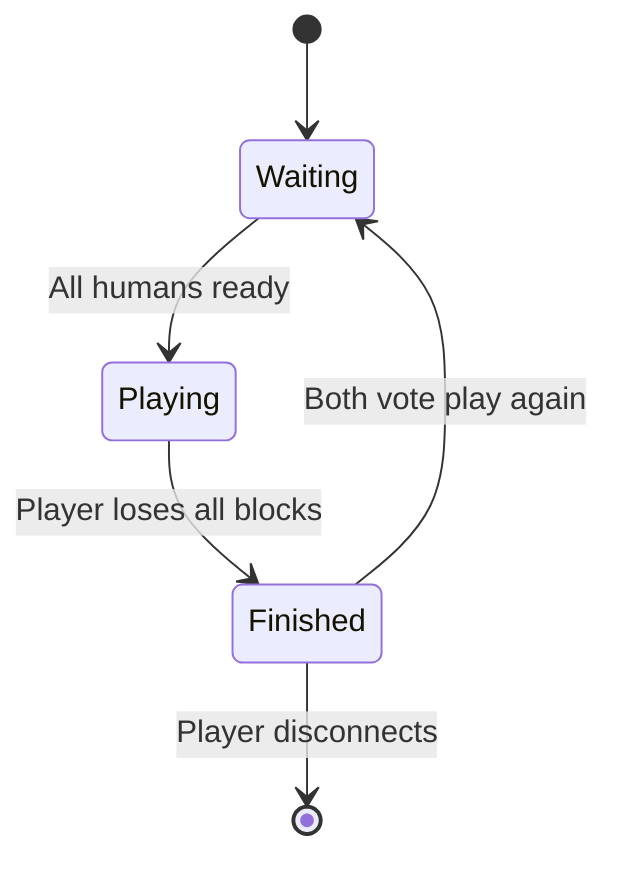

# Win Condition & Play Again Feature

## Overview

Detect when a player loses all 5 regular blocks (cannons are indestructible), declare a winner, and allow both players to vote for a rematch within the same session.

## Game Flow

## Changes

### 1. Protocol Messages ([packages/shared/src/protocol/index.ts](packages/shared/src/protocol/index.ts))

Add new messages:

- **Server → Client**: `game_over` with `winnerId`, `winnerNumber`, `reason` ("blocks_destroyed")
- **Client → Server**: `play_again_vote` - player votes to play again
- **Server → Client**: `play_again_status` with vote counts or "waiting for opponent"
- **Server → Client**: `game_reset` - new round starting, includes fresh block positions

Extend `GamePhaseSchema` to include `'finished'`.

### 2. Game State ([packages/server/src/game/GameState.ts](packages/server/src/game/GameState.ts))

Add methods:

- `getRegularBlockCountForPlayer(playerId)` - count non-cannon blocks
- `checkForWinner()` - returns winnerId if opponent has 0 regular blocks
- `resetForNewRound()` - clears blocks/projectiles, creates fresh blocks for existing players

Add to Player type:

- `wantsPlayAgain?: boolean` - track play again vote

### 3. Game Manager ([packages/server/src/game/GameManager.ts](packages/server/src/game/GameManager.ts))

After processing block destruction in `tick()`:

- Call `checkForWinner()` 
- If winner found: transition to `'finished'` phase, broadcast `game_over`
- Stop game loop processing (but keep connections alive)

Add handlers:

- `handlePlayAgainVote()` - mark player's vote, check if both agreed
- When both agree (bot auto-agrees): call `resetForNewRound()`, broadcast `game_reset`, transition back to `'waiting'`

### 4. Protocol Handlers ([packages/server/src/protocol/handlers.ts](packages/server/src/protocol/handlers.ts))

Add `handlePlayAgainVote` handler.

### 5. Human Client

**GameClient** ([packages/client/src/network/GameClient.ts](packages/client/src/network/GameClient.ts)):

- Add `onGameOver`, `onPlayAgainStatus`, `onGameReset` event handlers
- Add `sendPlayAgainVote()` method

**Main** ([packages/client/src/main.ts](packages/client/src/main.ts)):

- Handle `game_over`: show win/lose overlay with "Play Again" button
- Handle `play_again_status`: show waiting state
- Handle `game_reset`: clear scene, recreate blocks, transition to waiting phase (show hand raise overlay again)

**UI** ([packages/client/src/styles.css](packages/client/src/styles.css), [packages/client/index.html](packages/client/index.html)):

- Add game over overlay with winner announcement and "Play Again" button

### 6. Bot Client ([packages/server/src/bot/BotClient.ts](packages/server/src/bot/BotClient.ts))

- Handle `game_over`: stop behavior loop
- Handle `game_over`: immediately send `play_again_vote` (bot always agrees)
- Handle `game_reset`: reset internal state, wait for `game_started` to resume

## Key Details

- **Win condition**: Player wins when opponent has 0 regular blocks remaining (out of 5)
- **Cannons don't count**: They're indestructible, so excluded from win check
- **Play again voting**: Both players must vote; bots auto-vote yes